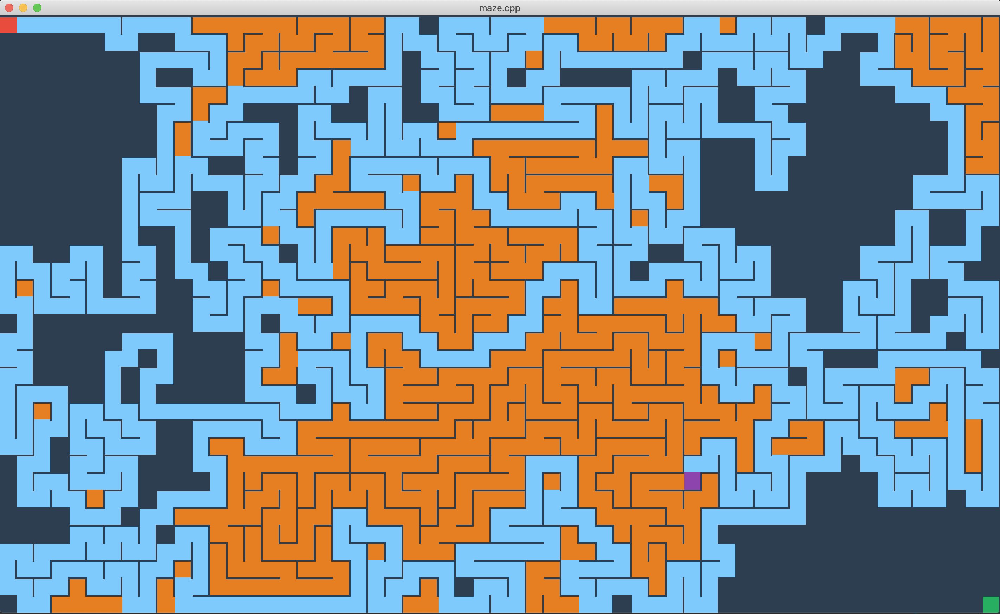
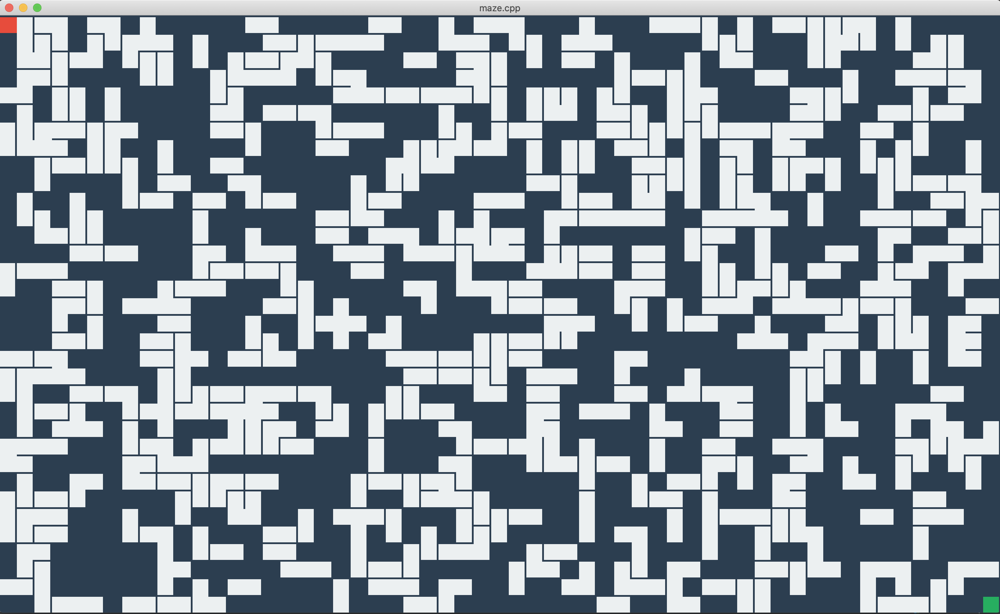
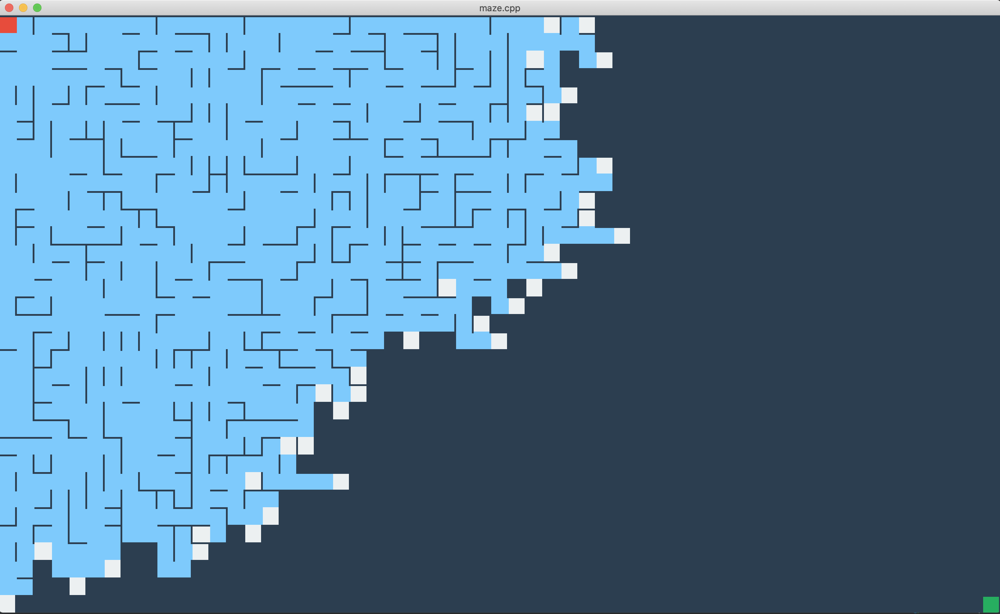
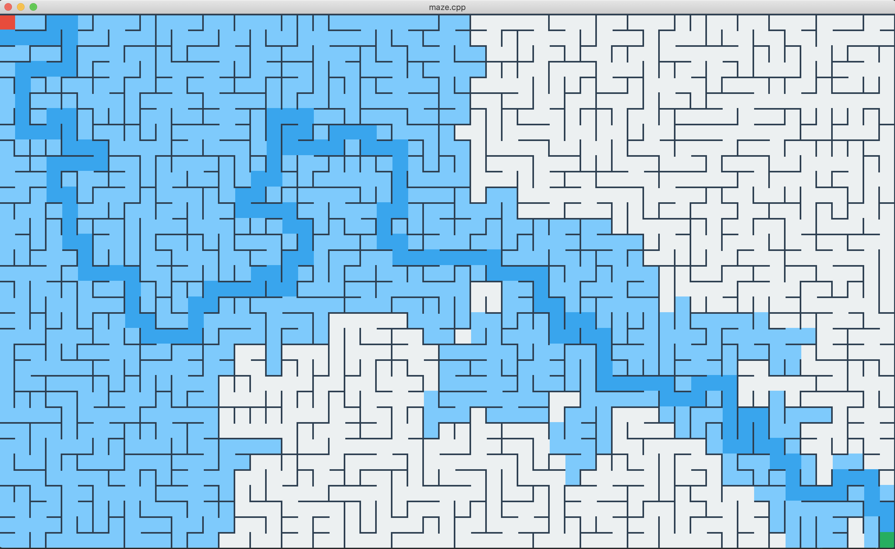
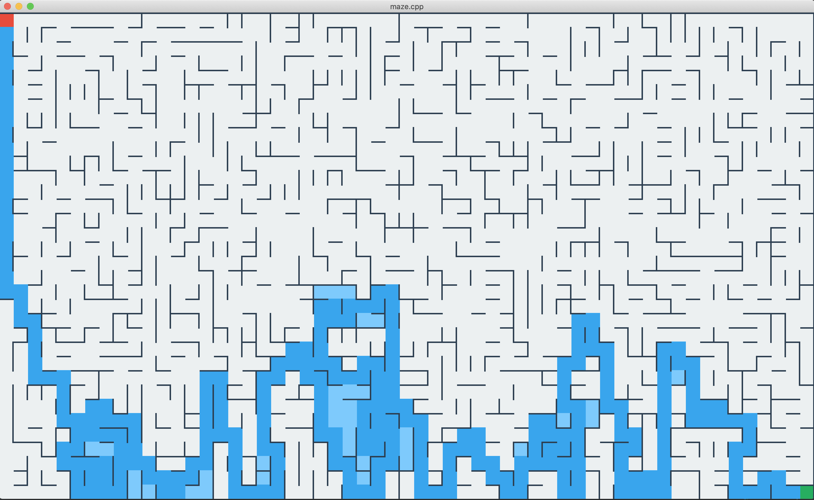
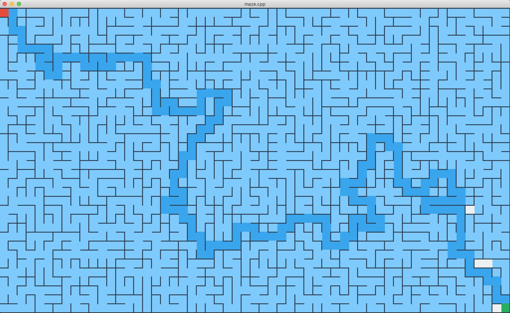

# :camera: Here are screenshots of maze generation and solving

## :cyclone: Generation
### :arrow_left: Backtracker algorithm

### :musical_score: Kruskal's algorithm

### :deciduous_tree: Prim's algorithm

## :zap: Solving
### :dart: A* algorithm

### :golf: DFS algorithm

### :ocean: BFS algorithm
